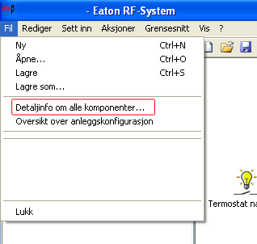
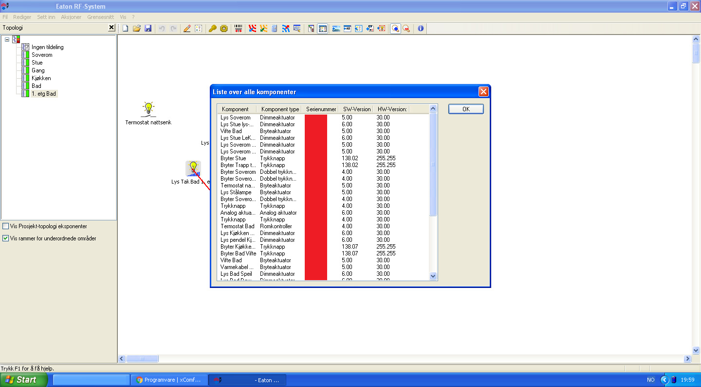

# How to use the integration

## Run commands
```bash
# Make directories
mkdir -p ~/.homeassistant/custom_components/

# Change to correct directory
cd ~/.homeassistant/custom_components/

# Checkout repo
git clone git@github.com:olekenneth/pyXcomfort.git

# PIP install local version
pip install ./pyXcomfort

# Symlink integration
ln -s pyXcomfort/integrations/home-assistant/* .
```

## Add Xcomfort configuration.yaml
```yaml
xcomfort:
  device: /dev/ttyUSB0 # default
  timeout: 10 # For how many seconds the binary sensor to be "on" after a button push. Default 240
  switches:
    - serial: 5109324
      name: Wallswitch Livingroom
  devices:
    - serial: 2118499
      name: Pendel
    - serial: 5077172
      name: Plafond
```
Where do I get the serial from? You need to look in the [Eaton MRF software](http://www.eaton.eu/Europe/Electrical/ProductsServices/Residential/xComfort-RFSmartHomeSolutions/PCT_1118492#tabs-11)



Open File > Details about components



Look at the Serienummer column (serial number). I have removed mine, but hopefully you will find your there.

Then you can restart Home Assistant
